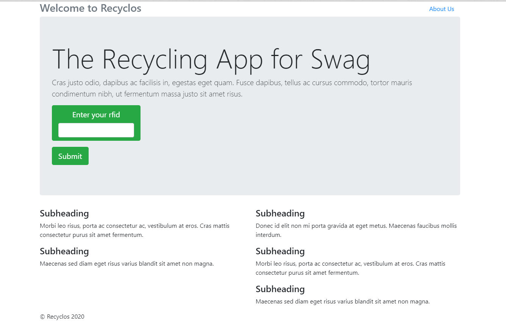

# Recycle-O's the Recycling App for Swag

An application we created during the Hackathon. We received the third-place award for this application. 

Recycle-O's is a two-part application. The first is the ability to use a trained model with the help of a Google Vision API to insert trash into a special box that would be scanned and figure out if you can recycle it or not. The next part is one where you can register yourself in the form of an RFID card and scan said box and get points for each time you add recyclables. The points will give you badges shareable on social media, and a place on the leaderboard.

When greeted by the homepage it will ask for an RFID number. The allowable numbers are 001,002,003,004 and 005. Next, you will be given the option to go to either the leaderboard, which will give a readout of where the list is or your user profile.

In the user profile, there will be some readout's of your information, and in the top right there will be your badge. The badges were all based on submissions in an Orlando flag competition. Given more time, below that would have been the actual images received from.

##Team:

* Ryan Harrigan 
* Matt Lucas
* Brian Clincy
* Javier Carrion
* Mahavir

## All the .env fil locations:
* project root `./`
* `mysqldb`
* `app/frontend`
* `app/backend`
